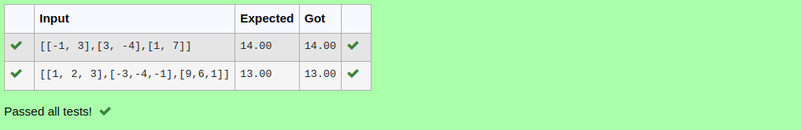
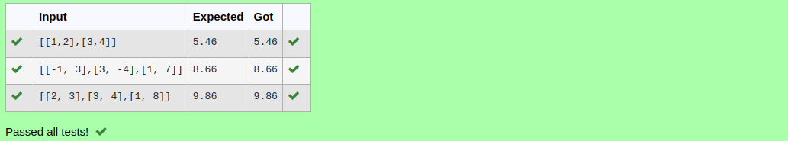
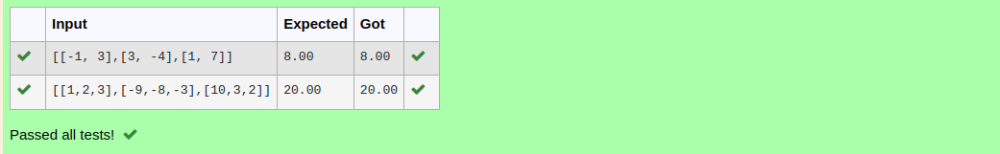

# Norm of a matrix
## Aim
To write a program to find the 1-norm, 2-norm and infinity norm of the matrix and display the result in two decimal places.
## Equipment’s required:
1.	Hardware – PCs
2.	Anaconda – Python 3.7 Installation / Moodle-Code Runner
## Algorithm:
	1. Get the input matrix using np.array()   
    2. Find the 2-norm of the matrix using np.linalg.norm()
	3. Print the norm of the matrix in two decimal places.
## Program:
```
Python
# Register No:22008582
# Developed By:SUjithra B K N
# 1-Norm of a Matrix
import numpy as np
mat=np.array(eval(input()))
ans=np.linalg.norm(mat,1)
norm_of_matrix="{:.2f}".format(ans)
print(norm_of_matrix)
# 2-Norm of a Matrix
import numpy as np
mat=np.array(eval(input()))
ans=np.linalg.norm(mat,2)
norm_of_matrix="{:.2f}".format(ans)
print(norm_of_matrix)
# Infinity Norm of a Matrix
import numpy as np
mat=np.array(eval(input()))
ans=np.linalg.norm(mat,np.inf)
norm_of_matrix="{:.2f}".format(ans)
print(norm_of_matrix)
```
## Output:
### 1-Norm of a Matrix

### 2-Norm of a Matrix

### Infinity Norm of a Matrix

## Result
Thus the program for 1-norm, 2-norm and Infinity norm of a matrix are written and verified.
